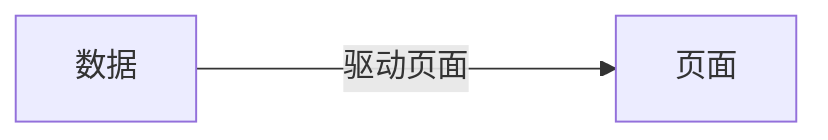
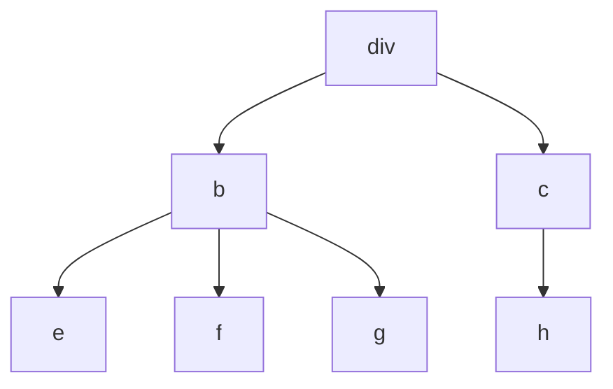
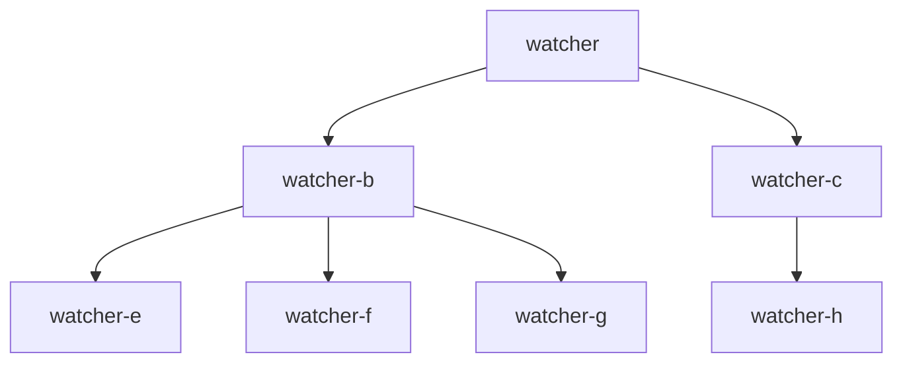

## 前端框架发展历史

> -1990年 第一个Web浏览器诞生  
> -1994年 网景公司发布第一个商业浏览器Navigator  
> -1995年 Brendan Eich 设计了 JavaScript  
> -2002年 IE在浏览器中拔得头筹，占有率超过96%  

------------------------------
90年代之前，受限于网速，网页都是单一静态页面，大部分都只是 HTML + CSS。随着后端技术的发展，代码从揉在一起发展到 Model，View 和 Controller，分别负责不同的功能。这就是后端的MVC模式，我们可以在模板里写上要展示的数据，让 Model 来负责数据。  
而前端则需要展示数据库的数据，除了 HTML、CSS、JavaScript，我们也开始使用 JSP 和 Smarty，写出来的代码长这样：

```html
<!DOCTYPE html>
<html>

<head>
    <meta charset="UTF-8" />
    <title>smarty test</title>
</head>

<body>
    {$name}
</body>

</html>
```

但是这种模式的缺点就是：任何数据更新，都需要刷新整个页面，这在当时会大大增加网页加载的时间。  

> 2004年，Google 发布 Gmail，用户可以在不刷新页面的情况下进行复杂的交互。Ajax 让我们可以异步的获取数据并且刷新页面，并逐渐成为网页开发的技术标准，也宣告了 Web2.0 时代正式到来。  

### 铁器时代 jQuery + Bootstrap  

这一时期的代码，就是找到某个元素，进行 DOM 操作。但随着前端项目规模的逐渐提升，前端也需要规模化的时候，AngularJS 和 Node.js 应运而生。  

### 工业时代 AngularJS + Node.js

AngularJS 的诞生，引领了前端 MVVM 模式的潮流；Node.js 的诞生，让前端有了入侵后端的能力，也加速了前端工程化的诞生。

> **MVVM**，就是在前端的场景下，把 **Controller** 变成了 **View—Model** 层，作为 Model 和 View 的桥梁，Model 数据层和 View视图层交给 View-Model 来同步。  



_**vue1.x 的解决方案**_





在网页中使用 `{{}}` 渲染一个变量，Vue 1 就会在内容里保存一个监听器（[*watcher*](https://v3.cn.vuejs.org/guide/computed.html#%E4%BE%A6%E5%90%AC%E5%99%A8)）监控这个变量

_**React 的解决方案**_

虚拟 DOM——用一个 JavaScript 对象来描述整个 DOM 树，可以很方便的通过虚拟 DOM 计算出变化的数据，去进行精确的修改。

```javascript
{
    tag: "div",
    attrs: {
        id: "app",
    },
    children: [{
            tag: "p",
            attrs: {
                className: "item"
            },
            children: ["Item1"]
        },
        {
            tag: "p",
            attrs: {
                className: "item"
            },
            children: ["Item2"]
        }
    ]
}
```

这个对象完整地描述了 DOM 的树形结构，这样数据有变化的时候，我们就能通过计算得到需要修改的 DOM，再对页面进行相应的操作。  

> [虚拟DOM与Diff算法](https://zhuanlan.zhihu.com/p/20346379)


### Vue 与 React 框架的对比

**数据更新逻辑**：  
-Vue： 如果数据发生变化，框架会主动告知修改了哪些数据；  
-React： 如果数据发生变化，只能通过新老数据的计算 Diff 来得知数据的变化。

**缺点**：  
-Vue：响应式数据新建 watcher 比较损耗性能，会随着项目规模的增大而增加。  
-React：如果虚拟 DOM 树过于庞大，会导致计算时间过长（大于 1s / 60fps = 16.6ms），造成性能损失。

**解决方案**：  
-React：引入 Fiber 架构，把整个虚拟 DOM 树微观化，变成链表，利用浏览器的空闲时间计算 Diff 。


右侧的 Fiber Tree 把树形结构改造成了链表，遍历严格地按照子元素 --> 兄弟元素 --> 父元素的逻辑，随时可以中断和恢复 Diff 的计算过程。  


-Vue： 在 Vue2 中引入虚拟 DOM 来解决响应式数据过多的问题。对 Vue2 来说，组件之间的变化，可以通过响应式来通知更新。组件内部的数据变化，则通过虚拟 DOM 去更新页面。这样就把响应式的监听器，控制在了组件级别，而虚拟 DOM 的量级，也控制在了组件的大小。  


